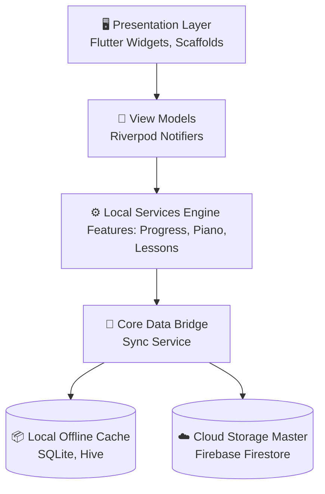

<div align="center">

# 🎹 Melodify

**The Ultimate Interactive Piano Learning Companion Built With Flutter & Riverpod.**

[](#)
[](#)
[](#)
[](#)
[](#)

*Master piano skills with interactive lessons, practice exercises, real-time auditory feedback, and robust progress tracking. Melodify redefines virtual piano learning.*

---

</div>

<br/>

## ✨ Why Melodify?

Melodify isn’t just a simple keyboard app—it’s an **entire conservatory in your pocket**. Leveraging the extreme modularity of **Flutter** and the reactive state synchronization of **Riverpod**, Melodify ensures 0-latency key presses, instant audio synthesis, and seamless cloud-synced progression across all your devices.

- 🎵 **Ultra-Low Latency Audio**: Native audio hooks for realistic grand piano simulation.
- 📈 **Gamified Learning**: Expansive achievements, streaks, and dynamically unlocking objectives.
- 📱 **Multi-Tier Architecture**: Offline-first caching with SQLite & Hive paired with Firebase Cloud synchronization.
- 🔒 **Dynamic Environment Injection**: Secure, environment-based remote configurations (DotEnv enabled).

<br/>

## 💎 Core Features

<table>
<tr>
<td width="50%">
<h3>🎹 Interactive Piano System</h3>
<ul>
<li><b>Full 88-Key Range:</b> Immersive octave mapping from A0 to C8.</li>
<li><b>0-Latency Audio:</b> Driven by highly optimized pre-cached <code>audioplayers</code> streams.</li>
<li><b>Visual Feedback Loop:</b> Advanced lighting & shadow physics per key depression.</li>
<li><b>Touch & Velocity Emulation:</b> Seamless polyphonic touch interaction.</li>
</ul>
</td>
<td width="50%">
<h3>🎓 Smart Learning Engine</h3>
<ul>
<li><b>Adaptive Curriculum:</b> Progressively scaling difficulty curves.</li>
<li><b>Detailed Breakdowns:</b> Learn chords, scales, and sheet music reading interactively.</li>
<li><b>AI-Like Review Algorithms:</b> Evaluates accuracy, timing, and note-consistency.</li>
<li><b>Real-Time Guidance:</b> Highlight overlays targeting learning keys.</li>
</ul>
</td>
</tr>
<tr>
<td width="50%">
<h3>🎮 Gamification Layer</h3>
<ul>
<li><b>X-Level Progression System:</b> Earn XP dynamically.</li>
<li><b>Streak Tracking:</b> Maintains user retention via daily challenges.</li>
<li><b>Custom Badges:</b> Lottie-powered achievement unlocking aesthetics.</li>
<li><b>Live Metrics Dashboard:</b> Fl_chart driven interactive statistics.</li>
</ul>
</td>
<td width="50%">
<h3>☁️ Cloud & Persistence</h3>
<ul>
<li><b>Offline-First Operations:</b> Hive/SQLite caching ensures you can learn in airplane mode.</li>
<li><b>Background Sync Engine:</b> Bidirectional conflict resolution against Firestore.</li>
<li><b>Secure Auth Identity:</b> Multi-method Google/Firebase authentication.</li>
<li><b>Dynamic Over-The-Air Setup:</b> Configuration scaling via .env mechanisms.</li>
</ul>
</td>
</tr>
</table>

<br/>

## 📸 Immersive Interface

> *Our UI/UX pushes the boundaries of Flutter’s 120fps Ski/Impeller rendering pipeline. (Add your screenshots directly to `assets/screenshots/`)*

<div align="center">

| Dashboard & Stats | Piano Gameplay | Interactive Lessons | Lesson Details |
| :---: | :---: | :---: | :---: |
|  |  |  |  |

| Progress Tracking | Achievements Grid | Splash Screen | Profile View |
| :---: | :---: | :---: | :---: |
|  |  |  |  |

</div>

<br/>

## 🏗️ State-of-the-Art Architecture

Melodify adopts an enterprise-scale **Feature-Based Architecture**, rigorously decoupling UI logic, business orchestration, and data ingestion via multi-tiered Riverpod providers.



### 🧠 Tactical Stack Choices
- **Riverpod 2.4+**: Replacing standard Provider for compile-time safety and dependency inversion.
- **go_router 13.0**: Complex nested bottom-navbar routing, protected auth-guards, and deep link readiness.
- **SQLite + Hive Synergy**: Hive handles O(1) user-preference reads; SQLite handles heavy relational querying for lesson progression.
- **Dotenv Isolation**: Secure credential housing allowing rapid open-source scaling without credential leaks.

<br/>

## 🚀 Extreme Rapid Setup

Want to compile this masterpiece locally? Let's get you set up under 3 minutes.

### 1️⃣ Clone & Initialize
```bash
git clone https://github.com/Junaid546/Piano_learning-_app.git
cd Piano_learning-_app
flutter pub get
```

### 2️⃣ Secure Environment Allocation
Melodify natively protects keys. Create an `.env` file locally based on our template.
```bash
cp .env.example .env
```
*(Open `.env` and insert your Firebase Project API variables. We do not track `.env`)*

### 3️⃣ Firebase CLI Integration
*(Optional: If rebuilding for a new project or linking your own remote)*
```bash
flutterfire configure
```
Make sure your Android `google-services.json` and iOS `GoogleService-Info.plist` are placed correctly.

### 4️⃣ Engage Engine
```bash
flutter run
```

<br/>

## 🧪 Comprehensive Benchmarking & Testing

We uphold strict continuous integration pipelines. Verify execution locally:
```bash
# Unit + State Notifier Mocks
flutter test

# UI & Interaction Mapping
flutter test integration_test/
```

<br/>

## 📱 Build Profiles

Ready for production? Compiling is strictly locked and optimized.

**Android (AAB):**
```bash
flutter build appbundle --release --obfuscate --split-debug-info=build/app/outputs/symbols
```
**iOS (IPA):**
```bash
flutter build ipa --release
```

<br/>

## 🤝 Community & Engineering Contributions

This application is an ever-evolving work of art. 

1. **Fork** the Repository.
2. **Branch** off (`git checkout -b feature/QuantumAudioLogic`).
3. **Commit** rigorously (`git commit -m 'feat: Overhauled Lottie transitions'`).
4. **Push** (`git push origin feature/QuantumAudioLogic`).
5. Open a legendary **Pull Request**.

---

<div align="center">

### 🧑‍💻 Vision & Engineering

**Designed, Architected, and Delivered by [Junaid Tahir](https://github.com/Junaid546).** 

*Need direct engineering access? Reach out at: [junaidt950@gmail.com](mailto:junaidt950@gmail.com).*

`MIT Licensed` | `Tested on Android 14 / iOS 17` | `Powered by Dart 3`

</div>
