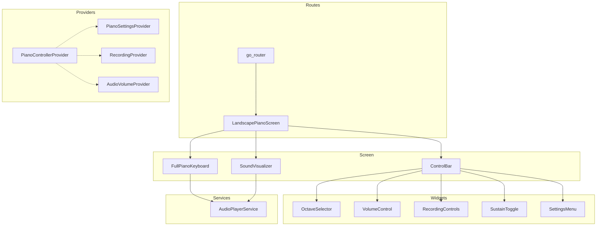

# Landscape Piano Screen Implementation Plan

## Overview
Create a professional, full-featured landscape piano playing screen for the Melodify app. Focus on performance optimization first, with 3-4 octaves and scrollable keyboard, plus both wave and bars visualizer types.

## Architecture Overview



## File Structure

```
lib/features/free_piano/
├── models/
│   ├── piano_settings.dart
│   ├── octave_range.dart
│   └── recording_session.dart
├── providers/
│   ├── piano_controller_provider.dart
│   ├── recording_provider.dart
│   └── piano_settings_provider.dart
├── screens/
│   └── landscape_piano_screen.dart
├── widgets/
│   ├── full_piano_keyboard.dart
│   ├── piano_controls_bar.dart
│   ├── octave_selector.dart
│   ├── sound_visualizer.dart
│   └── recording_controls.dart
└── utils/
    └── orientation_manager.dart
```

## Implementation Steps

### Step 1: Data Models

#### 1.1 PianoSettings
```dart
class PianoSettings {
  final int octaveRange;        // 1, 2, 3, or 4 octaves
  final int startingOctave;     // which octave to start from
  final bool showNoteLabels;    // show C, D, E labels
  final bool showOctaveNumbers; // show C4, D4, etc.
  final bool sustainEnabled;    // sustain pedal state
  final bool soundEnabled;      // mute/unmute
  final double volume;          // 0.0 to 1.0
  final Color keyHighlightColor;
  final bool keyPressAnimation;
  final bool velocitySensitivity;
  final String selectedInstrument; // piano, organ, synth
}
```

#### 1.2 OctaveRange
```dart
class OctaveRange {
  final int startOctave;
  final int endOctave;
  final int totalKeys;
  final List<PianoKey> whiteKeys;
  final List<PianoKey> blackKeys;
  
  // Helper methods
  PianoKey? getKeyByNote(String noteName, int octave);
  List<PianoKey> getAllKeys();
  double getNoteFrequency(String note, int octave);
}
```

#### 1.3 RecordingSession (for future)
```dart
class RecordingSession {
  final String sessionId;
  final DateTime startTime;
  final List<RecordedNote> recordedNotes;
  final Duration duration;
  final bool isRecording;
}

class RecordedNote {
  final String note;
  final int octave;
  final int timestamp;      // milliseconds from start
  final int duration;       // how long key was held
  final double velocity;
}
```

### Step 2: Riverpod Providers

#### 2.1 PianoControllerProvider
```dart
class PianoController extends StateNotifier<PianoState> {
  final AudioPlayerService _audioService;
  
  void pressKey(String note, int octave, double velocity);
  void releaseKey(String note, int octave);
  void setOctaveRange(int start, int end);
  void toggleSustain();
  void setVolume(double volume);
}
```

#### 2.2 PianoSettingsProvider
```dart
// Persist settings to SharedPreferences
final pianoSettingsProvider = StateNotifierProvider<PianoSettingsNotifier, PianoSettings>((ref) {
  return PianoSettingsNotifier();
});
```

### Step 3: Main Screen

#### LandscapePianoScreen
- Force landscape orientation on open
- Hide status bar and navigation bar
- Immersive mode
- Stack layout: ControlBar -> Visualizer -> Keyboard
- Handle back button to restore orientation

### Step 4: Piano Keyboard Widget

#### FullPianoKeyboard
- Calculate key dimensions based on screen size
- Horizontal scroll for 3-4 octaves
- Multi-touch support with GestureDetector
- Custom paint for keys
- Optimized hit testing
- Note labels toggleable

#### Key Layout Math
```
White Key Width = AvailableWidth / (Octaves * 7)
White Key Height = AvailableHeight * 0.65
Black Key Width = WhiteKeyWidth * 0.6
Black Key Height = WhiteKeyHeight * 0.65
```

### Step 5: Control Bar Widget

#### PianoControlsBar
- Back button (restore orientation)
- Octave range display/selector
- Volume control (slider)
- Settings icon
- Record button (pulsing when recording)
- Sustain toggle

### Step 6: Sound Visualizer

#### SoundVisualizer
- Wave form visualization (sine wave)
- Frequency bars (equalizer style)
- Toggle between types
- 60 FPS animation
- React to active notes

### Step 7: Settings & Integration

#### Settings Bottom Sheet
- Show/hide note labels
- Show/hide octave numbers
- Visualizer type selection
- Key press animation toggle
- Volume control

#### Route Integration
Add to `lib/app/routes.dart`:
```dart
GoRoute(
  path: '/free-piano',
  name: 'free-piano',
  pageBuilder: (context, state) => const NoTransitionPage(
    child: LandscapePianoScreen(),
  ),
),
```

## Performance Optimization Strategies

### 1. Audio Preloading
- Preload all 88 piano notes on app start
- Use player pool (20 players) for polyphony
- Fire-and-forget audio playback

### 2. Widget Rendering
- Use `const` constructors
- Minimize rebuilds with proper state management
- Custom paint for keys (not individual widgets)
- Lazy loading for keys outside viewport

### 3. Touch Handling
- Multi-touch with 10+ simultaneous touches
- Efficient hit testing with pre-calculated key positions
- Prevent ghost touches

### 4. Animation Performance
- 60 FPS target
- GPU-accelerated animations
- Reduce animations option for accessibility

## Implementation Order

1. **Week 1**: Core Foundation
   - Create file structure
   - Implement data models
   - Create providers
   - Build basic screen with orientation handling

2. **Week 2**: Keyboard & Controls
   - Build full piano keyboard widget
   - Implement multi-touch handling
   - Add horizontal scrolling
   - Create control bar widget
   - Integrate with existing audio service

3. **Week 3**: Visualizer & Polish
   - Implement sound visualizer (wave & bars)
   - Add settings bottom sheet
   - Add smooth animations
   - Performance optimization

4. **Week 4**: Testing & Integration
   - Add to app routes
   - Test on multiple devices
   - Performance profiling
   - Bug fixes and polish

## Color Scheme Integration

Use existing app theme colors:
- Primary Purple: #7C4DFF
- Secondary Pink: #FF4081
- Accent Gold: #FFD700
- Dark background for landscape: #0D0D0D

## Success Criteria

- [ ] 60 FPS performance on mid-range devices
- [ ] Zero audio latency on key press
- [ ] Smooth multi-touch support (10+ keys)
- [ ] Horizontal scrolling for 3-4 octaves
- [ ] Both wave and bars visualizer working
- [ ] All controls functional
- [ ] Proper orientation handling
- [ ] Dark mode support
- [ ] Integration with existing audio service
